# Image Manipulation Software in C

**Course:** CSE1101L — Final Project
**Name:** Alfi Shahrin Tamim
**Roll:** 1816

A graphical image editor written in **C** using the **IUP (Portable User Interface)** toolkit.
It opens 24-bit uncompressed BMP images, applies image manipulation operations implemented
from scratch in C, and saves the result as a BMP file. Developed on Ubuntu (WSL2) with
IUP 3.32 and GCC.

## Features

- **Open / Display / Save** 24-bit BMP images using IUP file dialogs; the display refreshes
  after every operation
- **Grayscale** — luminance formula `gray = 0.299·R + 0.587·G + 0.114·B`, written to all
  three channels
- **Brightness** — user-specified value added to each channel, clamped to 0–255
- **Inversion** — `R = 255−R`, `G = 255−G`, `B = 255−B`
- **Horizontal / Vertical Flip** — in-place pixel swaps
- **Rotate 90° clockwise** — new image with width/height exchanged
- **Crop** — user-specified rectangular region, validated against image boundaries
- **Blur** — 3×3 neighborhood average, computed into a separate output image so results
  don't feed back into the calculation
- **Undo** — one level: the previous image is preserved before every operation and restored
  by swapping the two image pointers
- **Sharpen (bonus)** — 3×3 convolution with the kernel `0 −1 0 / −1 5 −1 / 0 −1 0`,
  results clamped to 0–255, edges handled by replicating border pixels
- **Error handling** — message dialogs (no crashes) for: no image loaded, unsupported or
  invalid file, invalid brightness value, crop region outside the image

## Screenshots

**Main window with an image loaded:**

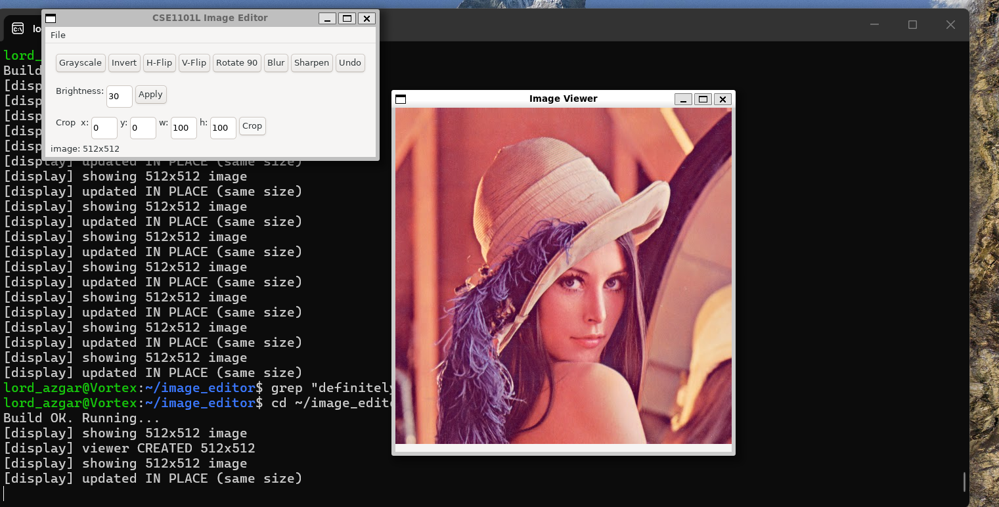

**Grayscale and inversion:**

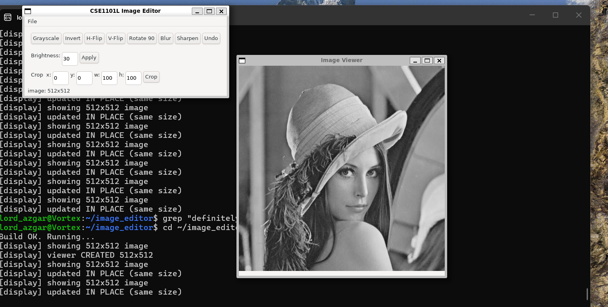

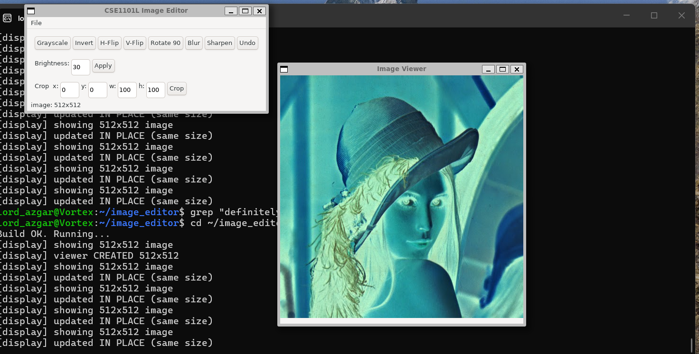

**Horizontal flip:**

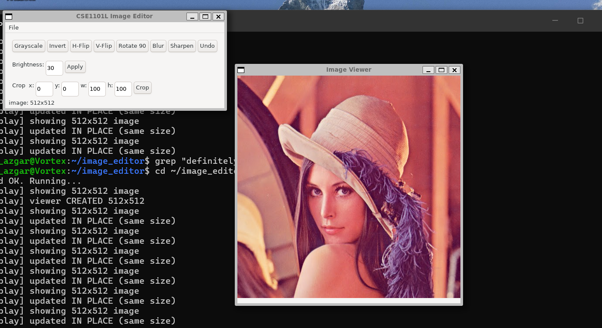

**Vertical flip:**

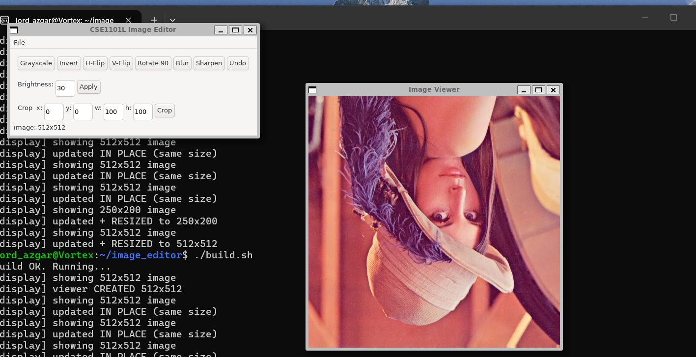

**90° rotation:**

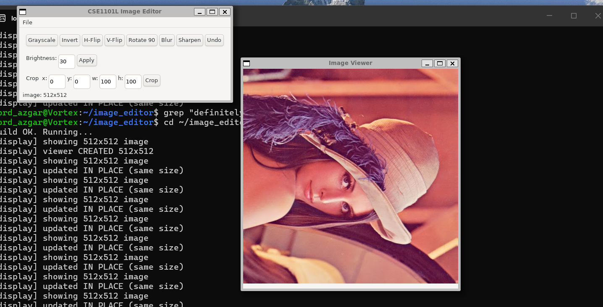

**Brightness adjustment (user-specified value, clamped to 0–255):**

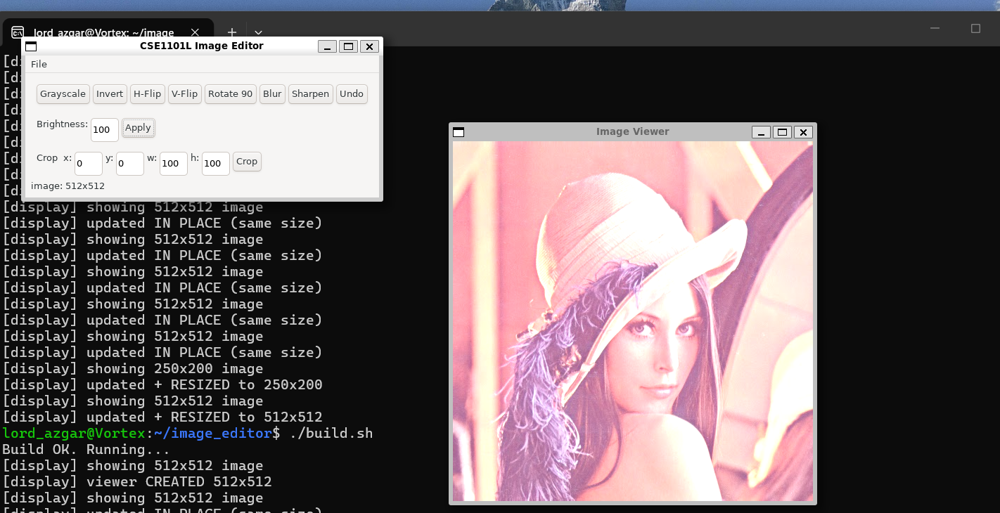

**Blur (3×3) and sharpen (3×3):**

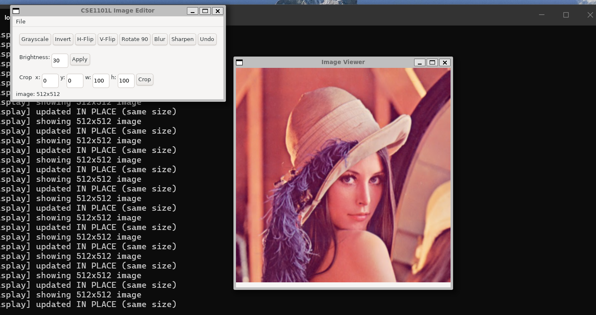

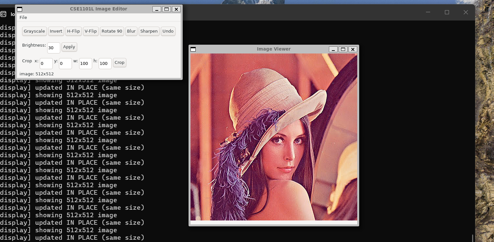

**Crop:**

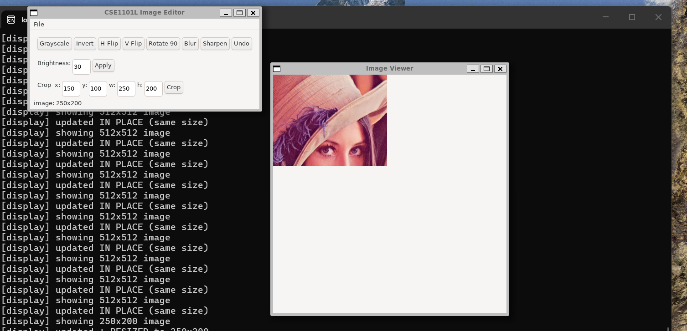

**Error handling — invalid brightness input:**

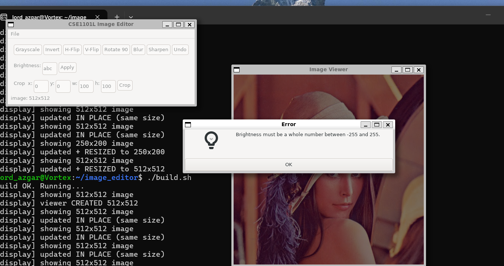

## Image representation

```c
typedef struct { unsigned char r, g, b; } Pixel;
typedef struct { int width, height; Pixel *data; } Image;
```

The pixel array is dynamically allocated (`malloc`) and indexed as
`image->data[y * image->width + x]` — a flat 1-D array treated as a 2-D grid.
Since `sizeof(Pixel) == 3`, the same buffer is passed directly to IUP's
`IupImageRGB()` for display.

## Project structure

| File | Contents |
|---|---|
| `main.c` | IUP GUI: dialogs, menus, buttons, callbacks, undo state |
| `image_io.c` | Image allocation, loading, saving, copying, freeing |
| `processing.c` | All manipulation algorithms (grayscale, brightness, invert, flips, rotate, crop, blur, sharpen) |
| `image.h` / `processing.h` | Structure definitions and function declarations |
| `build.sh` | Compile-and-run script |
| `stb_image.h` / `stb_image_write.h` / `stb_wrapper.h` | External library for BMP file reading/writing only |

GUI callbacks are thin: they validate input, save the undo copy, call the
algorithm function, and refresh the display — the algorithms live entirely in
`processing.c`, separate from the interface.

## Build and run

Requirements: GCC, IUP and CD with headers in `~/include` and libraries in `~`
(as set up for the course).

```bash
./build.sh
# or manually:
gcc -Wall -Wextra -o editor *.c -I$HOME/include -L$HOME -liup -lcd -lm
LD_LIBRARY_PATH=$HOME ./editor
```

## External libraries

Per the assignment, the **stb** libraries are used **only for reading and writing
the BMP file format**. Every image manipulation algorithm (grayscale, brightness,
inversion, flips, rotation, crop, blur, sharpening) is implemented from scratch
in C by the student.
